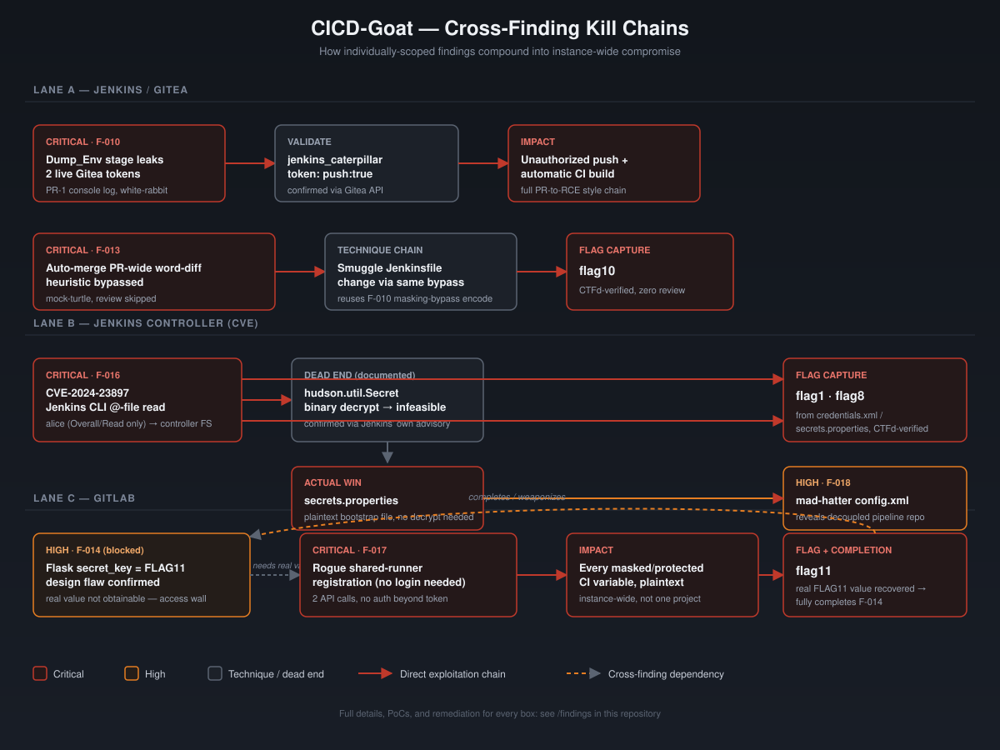

# CICD-Goat VAPT Writeup

> A full vulnerability assessment & penetration test against [OWASP CICD-Goat](https://github.com/cider-security-research/cicd-goat) — a deliberately vulnerable CI/CD environment (Jenkins, Gitea, GitLab, CTFd) — mapped end-to-end against the **OWASP Top 10 CI/CD Security Risks**.

[](https://github.com/cider-security-research/cicd-goat)
[](./findings)
[](./ctfd/challenge-cross-reference.md)
[](./LICENSE.md)

[](https://linkedin.com/in/dheerajkumarjayaswal)
[](https://github.com/dheeraj-jayaswal)

---

## Why this exists

Most CI/CD security writeups either stay purely theoretical (a slide explaining "poisoned pipeline execution") or purely CTF-flag-chasing (a one-line "here's the flag, next"). This repo tries to do neither: every finding below is a **fully validated, PoC-backed vulnerability**, mapped to a specific [OWASP CI/CD-SEC](./docs/02-owasp-top10-cicd-mapping.md) risk category, written the way you'd actually want to explain it in an interview or a real client report — including the dead ends, the wrong assumptions, and how they got corrected.

If you're studying for an AppSec/DevSecOps/CI-CD-security interview, prepping for a pentest engagement involving a CI/CD toolchain, or just want a concrete, hands-on tour of what "Poisoned Pipeline Execution" or "Insufficient Credential Hygiene" actually looks like on the wire — this is written for you.

## Target environment

| Field | Value |
|---|---|
| Target | [OWASP CICD-Goat](https://github.com/cider-security-research/cicd-goat) — local Docker Compose deployment |
| Engagement type | Authorized self-directed learning lab (grey-box) |
| Tech stack | Jenkins 2.332.1, Gitea 1.16.5, GitLab 15.11.13-ee, CTFd, Docker Compose |
| Scope | `localhost:3000` (Gitea), `:8080`/`:50000` (Jenkins), `:4000` (GitLab), `:8000` (CTFd), `:8008` (prod-sim) |
| Methodology | Phase 0–3 (Scope → Fingerprinting → Vulnerability ID → Exploitation) |

Full rules of engagement: [`docs/00-engagement-overview.md`](./docs/00-engagement-overview.md).

> ⚠️ **All testing in this repo was performed against the tester's own local, disposable, intentionally-vulnerable Docker Compose lab.** No production systems, shared infrastructure, or third-party data were involved. Spin up your own copy of CICD-Goat from the [official repo](https://github.com/cider-security-research/cicd-goat) before trying any of this yourself.

## Results at a glance

| ID | Title | Severity | OWASP CI/CD Mapping | CTFd Flag |
|---|---|---|---|---|
| [F-010](./findings/F-010-jenkins-secrets-exposure-console-logs.md) | Secrets exposure in Jenkins build console logs → credential theft → unauthorized repo write | **CRITICAL** | CICD-SEC-6, -4, -2 | flag1, flag2 |
| [F-013](./findings/F-013-insecure-automerge-bypass.md) | Insecure auto-merge logic bypasses code review (PR-wide word-diff heuristic) | **CRITICAL** | CICD-SEC-1, -5 | flag10 |
| [F-016](./findings/F-016-CVE-2024-23897-jenkins-cli-arbitrary-file-read.md) | CVE-2024-23897 — Jenkins CLI arbitrary file read on the controller | **CRITICAL** | CICD-SEC-7 | flag8 |
| [F-017](./findings/F-017-gitlab-runner-token-secret-theft.md) | GitLab shared-runner registration token → instance-wide CI/CD secret theft | **CRITICAL** | CICD-SEC-2, -6 | flag11 |
| [F-019](./findings/F-019-jenkins-controller-rce-agent-label-override.md) | Jenkins controller-node code execution via agent label override | **CRITICAL** | CICD-SEC-5, -4 | flag5 |
| [F-018](./findings/F-018-decoupled-pipeline-branch-exclusion-bypass.md) | Decoupled pipeline repo + branch exclusion filter bypass | HIGH | CICD-SEC-4, -6 | flag3 |
| [F-020](./findings/F-020-shared-agent-filesystem-credential-leak.md) | Shared agent filesystem exposes FreeStyle job credential | HIGH | CICD-SEC-6, -5 | flag6 |
| [F-021](./findings/F-021-checkov-sast-config-override-bypass.md) | Checkov SAST config override enables undetected IaC misconfiguration | HIGH | CICD-SEC-1, -8 | flag7 |
| [F-014](./findings/F-014-flask-secret-key-cicd-variable.md) | Flask session secret key derived from a CI/CD pipeline variable | HIGH | CICD-SEC-6 | flag11 (via F-017) |

Plus **6 informational / supporting findings** (positive controls, RBAC boundary confirmations, minor info-disclosure) in [`findings/informational/`](./findings/informational).

### How the findings chain together

Several findings aren't independent — one directly enables or completes another. This is the part that tends to impress in an interview more than any single finding on its own:



**9 of 11 CTFd challenges solved and flag-verified** — see the full [challenge cross-reference](./ctfd/challenge-cross-reference.md), including an honestly-documented case (Dormouse/flag9) where the access-control boundary held under sustained attack.

## Full Table of Contents

Every file below is directly linked — the folder tree just shows how they're organized.

### 📋 Engagement Docs

| File | What's in it |
|---|---|
| [`docs/00-engagement-overview.md`](./docs/00-engagement-overview.md) | Rules of engagement, scope, tech stack |
| [`docs/01-methodology.md`](./docs/01-methodology.md) | Phase-by-phase testing methodology used throughout |
| [`docs/02-owasp-top10-cicd-mapping.md`](./docs/02-owasp-top10-cicd-mapping.md) | Full CICD-SEC-1 through -10 reference taxonomy |
| [`docs/03-remediation-roadmap.md`](./docs/03-remediation-roadmap.md) | Prioritized, actionable remediation checklist |
| [`docs/04-interview-prep.md`](./docs/04-interview-prep.md) | Spoken-style summaries of every finding + likely follow-up questions |
| [`docs/05-lessons-learned.md`](./docs/05-lessons-learned.md) | Retrospective — what worked, what didn't, what to do differently next time |

### 🔍 Recon

| File | What's in it |
|---|---|
| [`recon/01-fingerprinting.md`](./recon/01-fingerprinting.md) | Phase 1 — unauthenticated fingerprinting of every service in scope |
| [`recon/02-authenticated-enumeration.md`](./recon/02-authenticated-enumeration.md) | Phase 2 — authenticated enumeration once initial access was gained |

### 🚨 Critical & High Findings

| File |
|---|
| [F-010 — Jenkins secrets exposure via console logs](./findings/F-010-jenkins-secrets-exposure-console-logs.md) |
| [F-013 — Insecure auto-merge bypass](./findings/F-013-insecure-automerge-bypass.md) |
| [F-014 — Flask secret key from CI/CD variable](./findings/F-014-flask-secret-key-cicd-variable.md) |
| [F-016 — CVE-2024-23897 Jenkins CLI arbitrary file read](./findings/F-016-CVE-2024-23897-jenkins-cli-arbitrary-file-read.md) |
| [F-017 — GitLab runner token secret theft](./findings/F-017-gitlab-runner-token-secret-theft.md) |
| [F-018 — Decoupled pipeline branch exclusion bypass](./findings/F-018-decoupled-pipeline-branch-exclusion-bypass.md) |
| [F-019 — Jenkins controller RCE via agent label override](./findings/F-019-jenkins-controller-rce-agent-label-override.md) |
| [F-020 — Shared agent filesystem credential leak](./findings/F-020-shared-agent-filesystem-credential-leak.md) |
| [F-021 — Checkov SAST config override bypass](./findings/F-021-checkov-sast-config-override-bypass.md) |

### ℹ️ Informational / Supporting Findings

| File |
|---|
| [F-006 — Private repo enumeration gap](./findings/informational/F-006-private-repo-enumeration-gap.md) |
| [F-007 — Additional Jenkins user](./findings/informational/F-007-additional-jenkins-user.md) |
| [F-009 — Job Read vs ExtendedRead](./findings/informational/F-009-job-read-vs-extendedread.md) |
| [F-011 — Correct withCredentials usage (positive control)](./findings/informational/F-011-correct-withcredentials-usage.md) |
| [F-012 — Credentials API connection drop](./findings/informational/F-012-credentials-api-connection-drop.md) |
| [F-015 — Anonymous registry enumeration](./findings/informational/F-015-anonymous-registry-enumeration.md) |

### 🎯 CTFd

| File | What's in it |
|---|---|
| [`ctfd/challenge-cross-reference.md`](./ctfd/challenge-cross-reference.md) | Full flag-by-flag cross-reference, including the blocked Dormouse/flag9 investigation and the Duchess/flag4 correction |

## Repo structure

```
.
├── docs/                          # Engagement context, methodology, mappings, remediation, interview prep
│   ├── 00-engagement-overview.md
│   ├── 01-methodology.md
│   ├── 02-owasp-top10-cicd-mapping.md
│   ├── 03-remediation-roadmap.md
│   ├── 04-interview-prep.md
│   └── 05-lessons-learned.md
├── recon/                         # Phase 1 & 2 — fingerprinting and authenticated enumeration
│   ├── 01-fingerprinting.md
│   └── 02-authenticated-enumeration.md
├── findings/                      # One file per confirmed finding, full PoC + remediation
│   ├── F-010-...md ... F-021-...md
│   └── informational/             # INFO/LOW severity supporting observations
├── ctfd/
│   └── challenge-cross-reference.md
└── LICENSE.md
```

## Reading paths

- **Just want the highlights?** Start with the [results table above](#results-at-a-glance), then read F-010, F-013, F-016, and F-017 — the four most complete end-to-end kill chains.
- **Studying for an interview?** Go straight to [`docs/04-interview-prep.md`](./docs/04-interview-prep.md) — one-paragraph, spoken-style summaries of every major finding, plus common follow-up questions.
- **Building/hardening a CI/CD pipeline?** Go straight to [`docs/03-remediation-roadmap.md`](./docs/03-remediation-roadmap.md) — a prioritized, actionable checklist.
- **New to CI/CD security concepts?** Start with [`docs/02-owasp-top10-cicd-mapping.md`](./docs/02-owasp-top10-cicd-mapping.md) for the reference taxonomy this whole repo is organized around.

## About OWASP Top 10 CI/CD Security Risks

Every finding here is mapped against the [OWASP Top 10 CI/CD Security Risks (2023)](https://owasp.org/www-project-top-10-ci-cd-security-risks/) — a full reference table (CICD-SEC-1 through CICD-SEC-10) lives in [`docs/02-owasp-top10-cicd-mapping.md`](./docs/02-owasp-top10-cicd-mapping.md), since it's referenced constantly throughout the individual findings.

## Disclaimer

This repository documents testing performed **exclusively against a local, self-hosted, intentionally-vulnerable training lab** ([OWASP CICD-Goat](https://github.com/cider-security-research/cicd-goat)), for educational and portfolio purposes. Nothing here targets, references, or was tested against any production system, third-party service, or real credential. Do not use any technique in this repo against systems you do not own or have explicit written authorization to test.

## License

This content is licensed under **[CC BY 4.0](./LICENSE.md)**. You're welcome to reuse or adapt any of this write-up — just give clear attribution to **Dheeraj Kumar Jayaswal** with a link back to this repository. CICD-Goat itself is a separate project by [Cider Security](https://github.com/cider-security-research/cicd-goat) — go star the original.

## Part of a Broader Security Portfolio

| Repository | What's in it |
|---|---|
| [From-Dev-To-Attacker](https://github.com/dheeraj-jayaswal/From-Dev-To-Attacker) | My flagship field journal — original vulnerability write-ups from a developer's lens, with enterprise domain-impact framing |
| [API-From-The-Trenches](https://github.com/dheeraj-jayaswal/API-From-The-Trenches) | Deep-dive API security series — OWASP API Top 10, BOLA, JWT attacks, GraphQL |
| [AppSec-From-The-Trenches](https://github.com/dheeraj-jayaswal/AppSec-From-The-Trenches) | Pentest tools & methodology reference |
| [Bug-Bounty-Hunting-Companion](https://github.com/dheeraj-jayaswal/Bug-Bounty-Hunting-Companion) | Real disclosed bug bounty reports as reproducible checklists |

## 🧠 Testing Philosophy

> *"The best security professionals think like developers first and attackers second. If you understand why systems are built the way they are, you will always find more than any scanner ever will."*

I approach every engagement in three phases: **understand before you attack** (read the app, use it as a real user, learn the business logic first) → **manual first, tools second** (the interesting bugs are found by thinking, not scanning) → **report like a developer** (a finding the dev team can't reproduce is a finding that never gets fixed).

## Author

- **Name** — Dheeraj Kumar Jayaswal
- **Role** — Technology Lead – Offensive Security, Infosys Limited
- **Focus** — Web Application & API Penetration Testing
- **Domains** — Income Tax · Banking · Retail · E-commerce · Freight Logistics · Education

### Certifications

| Certification | Issuer | Status |
|---|---|---|
| OSCP — Offensive Security Certified Professional | OffSec | 🔄 In Progress (2025–2026) |
| Certified Ethical Hacker (CEH) | EC-Council | ✅ 2021 |
| AWS Certified Solutions Architect – Associate | Amazon Web Services | ✅ 2022 |
| AWS Certified Cloud Practitioner | Amazon Web Services | ✅ 2022 |
| Executive Certificate in Cyber Security | IIT Kanpur | ✅ 2026 |

## 🌐 Connect

[](https://linkedin.com/in/dheerajkumarjayaswal)
[](mailto:jaiswal.dheeraj123@gmail.com)

Feedback, corrections, and PRs (e.g. for flag9/Dormouse, or the Duchess/flag4 follow-up in the [CTFd cross-reference](./ctfd/challenge-cross-reference.md)) are welcome — see [CONTRIBUTING.md](./CONTRIBUTING.md).
